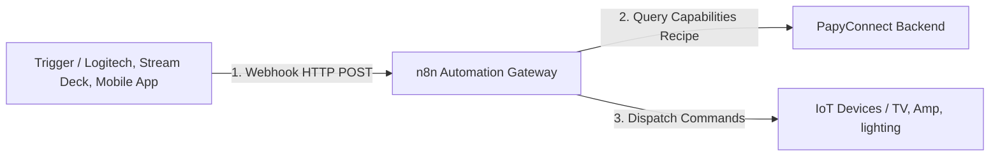
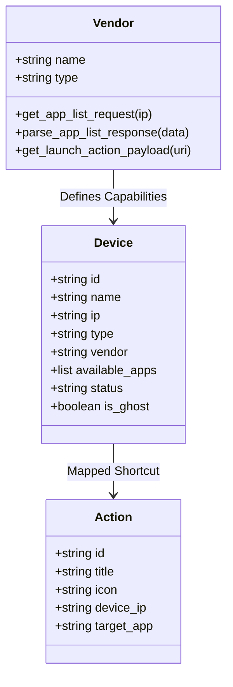

# Technical Architecture & Design Decisions

This document details the architectural choices, data models, network mechanisms, and interface design decisions behind the **PapyConnect** home lab ecosystem.

---

## 🏗️ System Overview

PapyConnect is designed as a decoupled, multi-tiered automation stack. It links tactile hardware controls to local network IoT devices through a centralized automation layer:



### Why Decouple Options+ and n8n?
1. **Low Footprint on Host**: Option+ extensions run locally on Windows/macOS. By delegating execution logic to `n8n` and device registry tracking to `PapyConnect` (running on a NAS/Server), the local computer remains lightweight.
2. **Unified Control**: `n8n` acts as the coordinator. The Logitech keypad triggers webhooks, but the same webhooks can be triggered by Siri, Home Assistant, Cron jobs, or NFC tags.
3. **Workflow Orchestration**: n8n can easily orchestrate complex scenarios (e.g., "Movie Mode": turn off Philips Hue lights, turn on Denon Amp, set input to TV, and launch Netflix on Sony Bravia) in a single workflow.

---

## 🛠️ Stack Technical Choices

Each technology in the stack was selected to maximize deployment simplicity, maintain a low memory footprint, and provide robust local network communication capabilities:

### A. Backend: FastAPI (Python 3.12)
* **Native Asynchrony (`asyncio`)**: Crucial for coordinating the active subnet ping loop and the passive mDNS scanner thread without blocking the main web server handling Options+ request controllers.
* **Auto-generated API Spec**: Provides a built-in Swagger/OpenAPI dashboard (`/docs`), making it trivial to inspect schemas when mapping new vendor APIs or syncing endpoints with n8n HTTP nodes.
* **Pydantic Validation**: Guarantees that request payloads from the wizard dashboard are structurally validated before parsing or writing to `registry.json`.

### B. Frontend: Tailwind CSS & Alpine.js
* **Zero-Build Architecture**: By importing Alpine.js and Tailwind CSS, PapyConnect avoids complex compilation pipelines (like Node.js, Webpack, or Vite). The entire frontend is self-contained and editable directly in the static `app/templates/` folder.
* **Alpine.js Reactive State**: Offers lightweight reactivity for modals, configuration wizards, and state polling with a negligible memory footprint compared to heavy SPA frameworks like React or Angular.

### C. Containerization: Docker Compose & Host Network Mode
* **`network_mode: host`**: Mandatory to bypass container bridge network isolation. By running on the host network directly, the background scanner can capture local LAN multicast UDP traffic (SSDP / mDNS) required for passive Chromecast, Spotify, and Sony TV detection.
* **Multi-container Orchestration**: Standardizes the launch, port bindings, and storage mounts of n8n and PapyConnect on synology NAS or Raspberry Pi systems using a single `docker compose up -d` command.

### D. Automation: n8n Gateway
* **Visual Workflows**: Empowers home lab users to design complex, multi-device routines visually instead of writing brittle scripts.
* **Protocol Adaptability**: n8n natively handles diverse node integration protocols (SSH, TCP Socket, HTTP, MQTT, WebSockets) allowing PapyConnect to stay lightweight and focused on device registry tracking.

---

## 🗂️ 1. Device, Vendor, and Action Data Structures

PapyConnect models the smart home using three key concepts: **Vendors** (classes), **Devices** (registry), and **Actions** (shortcuts).



### A. Vendor Class Hierarchy (`vendors.py`)
Device capabilities are encapsulated using polymorphic Python classes inheriting from a base `Vendor` class:
* **Base Vendor (`Vendor`)**: Defines the capability contracts, default ports, and helper methods.
* **Polymorphic Brand Subclasses**: Subclasses override how application listings are requested and parsed (e.g., `SonyVendor` queries DIAL XML endpoints on port `8008`, `LgTvVendor` queries WebOS, `DenonVendor` outputs static TCP commands).
* **Benefits**: Adding support for a new hardware brand only requires writing a clean subclass overriding request headers and parsers, with zero changes to the FastAPI routing layer.

### B. Device Registry (`registry.json`)
The central registry stores both discovered and manually added devices.
```json
{
  "name": "Bbox Salon",
  "ip": "192.168.1.99",
  "type": "tv",
  "vendor": "Bbox",
  "available_apps": ["Netflix", "YouTube", "Prime Video"],
  "status": "online",
  "is_ghost": false
}
```
* **`is_ghost` flag**: Tells the registry whether the device was added manually. Ghost devices bypass automatic mDNS cleanup passes if they fail to announce themselves over the network.

### C. Mapped Actions Database (`actions.json`)
Saves the user-created shortcuts bound to Option+ keypad LCD keys.
```json
{
  "id": "netflix_salon",
  "title": "Netflix (Salon)",
  "icon": "netflix",
  "device_ip": "192.168.1.99",
  "target_app": "launch_netflix"
}
```

---

## 📡 2. Scanner & Discovery Mechanisms (`discovery.py`)

To automatically populate the dashboard, PapyConnect deploys two parallel scanners:

### A. Active Subnet Pinging
* **How it works**: Uses asynchronous ICMP pings (`ping -c 1 -W 1 <ip>`) executing concurrently in an `asyncio.gather` pool.
* **Frequency**: Scans the resolved local subnet (e.g., `192.168.1.0/24`) every 30 seconds to update the `online`/`offline` reachability status of all registered devices.

### B. Background Passive mDNS Scanner
* **How it works**: Spawns a background thread powered by the `zeroconf` library listening for active multicast DNS announcements.
* **Service Types Tracked**:
  * `_googlecast._tcp.local.` (Google Home, Chromecast, smart speakers)
  * `_spotify-connect._tcp.local.` (Spotify devices)
  * `_bravia._tcp.local.` (Sony Smart TVs)
  * `_amzn-wfd._tcp.local.` (FireTV / Amazon Casting)
* **Merge Logic**: When an announcement is captured, PapyConnect merges the host details with the active database. If the device exists, it updates the IP/reachability; if not, it automatically registers it.

---

## 🎨 3. UI Design Decisions

The front-end interface in `app/templates/` is designed for visual appeal and accessibility for elderly relatives ("Papy-friendly"):

* **Zero Build-step Stack**: Built purely using HTML5, **Tailwind CSS** (for styling), and **Alpine.js** (for reactive client state). This allows the dashboard to load instantly and run inside light container systems.
* **Minimalist Wizard Flow**: Employs a three-step configuration wizard (1. Choose Device, 2. Choose Action, 3. Choose Icon) that hides the underlying complexity (IP addresses, HTTP methods, APIs) from the user.
* **Micro-Animations & Visual Cues**: Custom hover micro-animations, glassmorphic card widgets, and glowing online/offline status pulses provide intuitive tactile feedback.
* **Borderless SVGs**: App icons are rendered with borderless transparent designs, featuring high-contrast colored indicators for active/inactive status.

---

## 🔌 4. API Design & n8n Dynamic Execution Contracts

The API layer is exposed via FastAPI:

### A. Dynamic API Contract Resolution
Instead of hardcoding API request paths inside n8n or Options+, PapyConnect resolves execution instructions dynamically:
```http
POST /api/actions/{action_id}/execute
```
When this endpoint is called, PapyConnect fetches the mapped device and its associated `Vendor` class, compiles the exact required protocol payload (e.g., HTTP headers, raw TCP bytes), and returns the execution recipe:

```json
{
  "protocol": "HTTP",
  "url": "http://192.168.1.55:8008/apps/Netflix",
  "method": "POST",
  "headers": {
    "X-Auth-PSK": "1234",
    "Content-Type": "application/json"
  },
  "json": {}
}
```

### B. Why return a recipe instead of executing directly?
1. **Security Isolation**: The PapyConnect backend doesn't need external WAN exposure or outbound access tokens. n8n acts as the secure executing gateway agent.
2. **Protocol Adaptability**: n8n can process HTTP, TCP sockets, SSH, or MQTT commands using its standard nodes based on the parsed recipe schema, keeping the python registry clean and free of physical socket execution overhead.

### C. Interactive Swagger UI & OpenAPI Specification
FastAPI automatically generates a complete OpenAPI 3.0 specification from our routing endpoints and Pydantic models. This schema is rendered as an interactive dashboard at `/docs`:
* **Zero-dependency Developer Sandbox**: Allows developers or home lab administrators to quickly test routing actions (such as manually executing device actions, testing pings, or pulling brand discovery structures) directly in the browser without drafting scripts or terminal commands.
* **n8n Payload Synchronization**: The auto-generated structure makes it easy to copy-paste accurate JSON payloads and parameters directly into n8n HTTP Request nodes during workflow construction.
