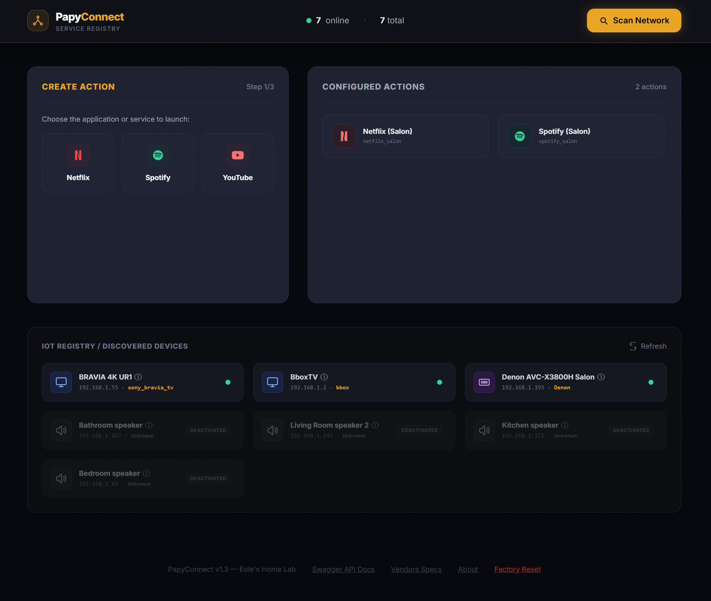
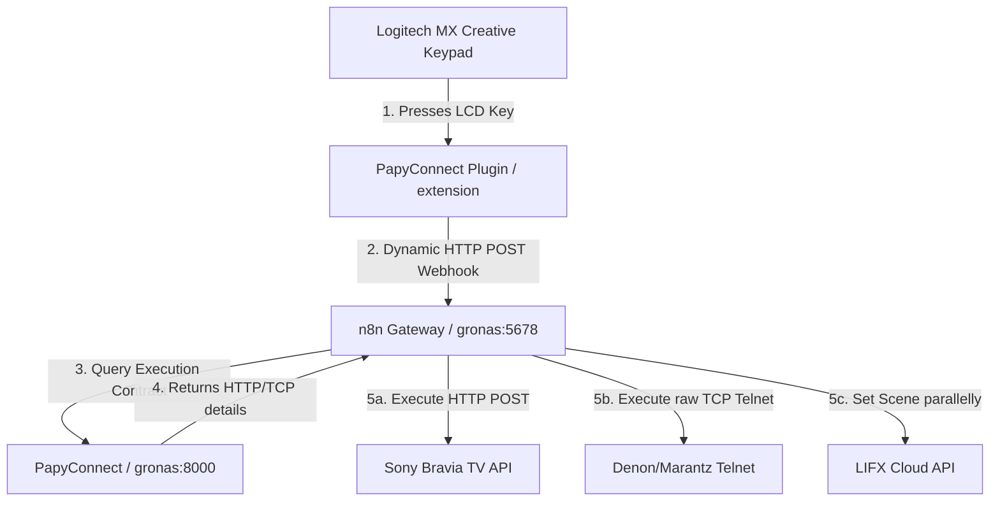
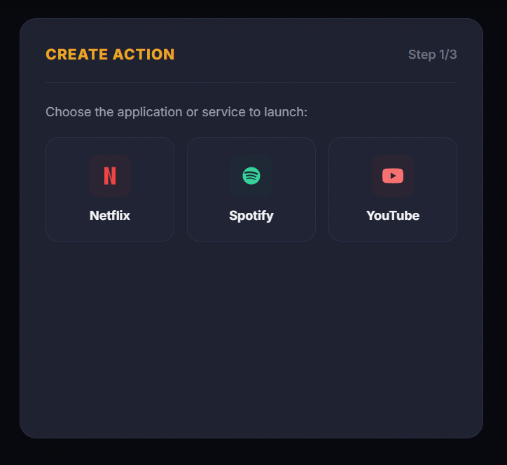
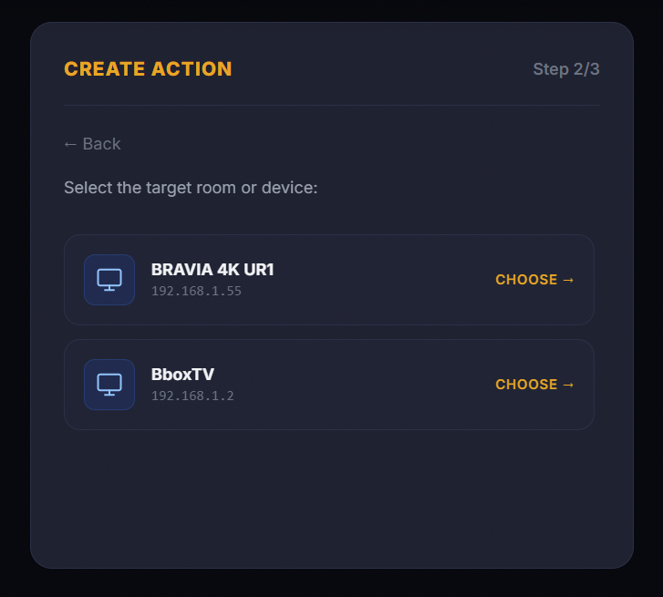
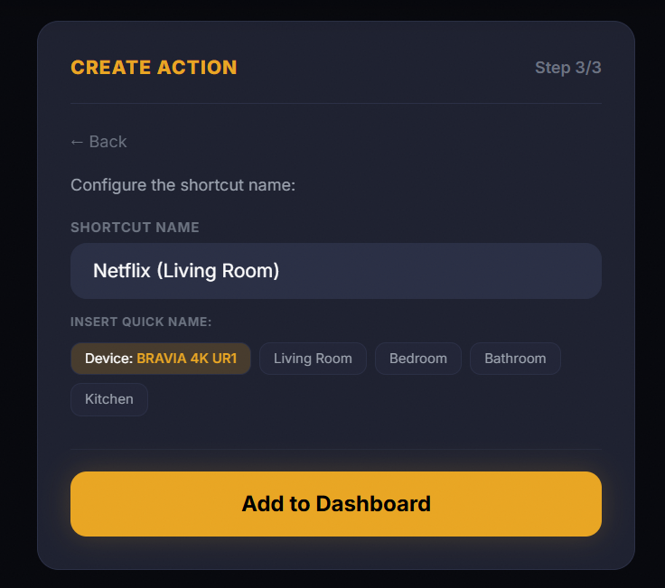
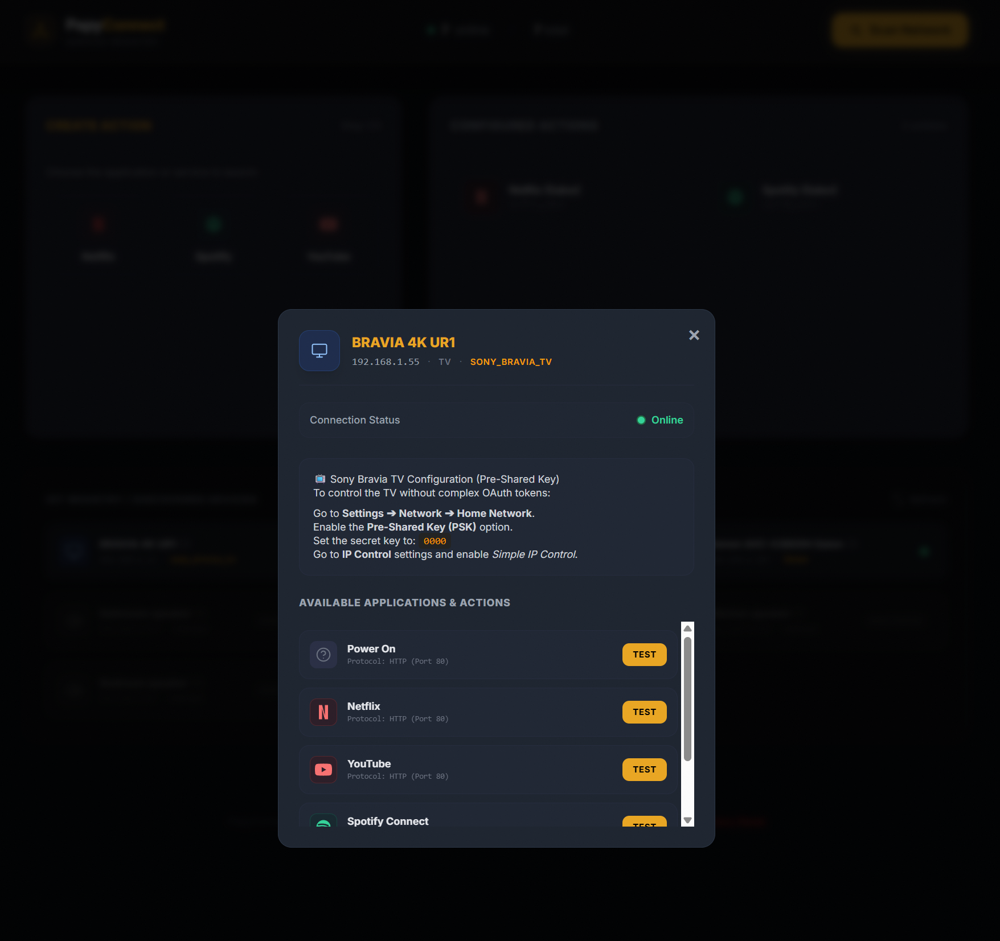
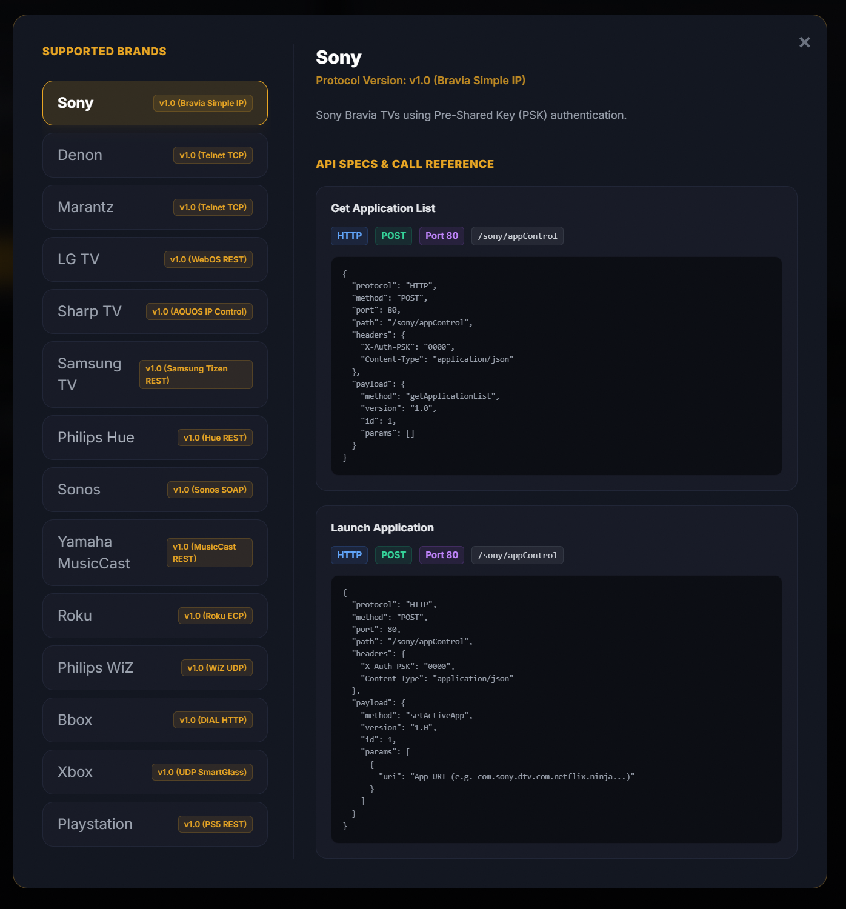

# PapyConnect Home Lab Integration Stack

> **The Pitch**: A zero-friction, visually stunning home multimedia automation hub designed specifically for parents and senior family members. The installation is performed once by a tech-savvy child on their parent's home NAS, and from that point onward, the parent is 100% autonomous. They can create, edit, or customize their Options+ smart keypad triggers using a gorgeous, simplified 3-step dashboard—no code, no configuration file editing, and no technical assistance required.



PapyConnect is a zero-friction, visually stunning home lab multimedia automation hub designed specifically for parents and senior family members. The installation is performed once by a tech-savvy child on their parent's home NAS, and from that point onward, the parent is 100% autonomous. They can create, edit, or customize their Options+ smart keypad triggers using a gorgeous, simplified 3-step dashboard—no code, no configuration file editing, and no technical assistance required.

Under the hood, triggering an action from the Logitech console is done via a simple, standard **HTTP POST** webhook call. This agnostic design makes the entire stack highly flexible: you could easily swap the Logitech keypad for an Elgato **Stream Deck**, an **HTTPRequest** shortcut app on Android, iOS widgets, or any other smart device capable of dispatching a web request. 

To keep the system open and future-proof, PapyConnect is entirely **agnostic to vendor ecosystems**. Supported appliances (like Sony Bravia TVs, Bouygues Bboxes, or Denon Amplifiers) are discovered automatically via background mDNS scans. Brand capabilities are represented polymorphically so that nothing is hardcoded; when an action is selected, PapyConnect compiles the execution details as a dynamic "recipe" payload that the n8n automation gateway executes.


---

## 🚀 System Architecture



---

## 🔌 PapyConnect C# Plugin (Loupedeck/Logi)

The compiled C# plugin is located in [PapyConnectPlugin/](file:///home/eole/projects/papyconnect/PapyConnectPlugin).

### 1. How it works
The plugin reads the n8n Gateway URL from a configuration file under a dedicated `PapyConnect` folder in your Windows Documents folder:
👉 `C:\Users\YOUR_USERNAME\Documents\PapyConnect\config.json`

Example:
```json
{
  "N8nGatewayUrl": "http://gronas:5678"
}
```

The dynamic action parameters are fetched automatically from the gateway and cached in:
👉 `C:\Users\YOUR_USERNAME\Documents\PapyConnect\n8n_triggers.json`

Example of cached triggers file:
```json
[
  {
    "id": "netflix_salon",
    "name": "Netflix Salon",
    "url": "http://gronas:5678/webhook/papyconnect-action?id=netflix_salon",
    "color": "#E50914"
  },
  {
    "id": "spotify_salon",
    "name": "Spotify Salon",
    "url": "http://gronas:5678/webhook/papyconnect-action?id=spotify_salon",
    "color": "#1DB954"
  }
]
```

- **id**: Unique key identifier.
- **name**: Label displayed on the LCD key.
- **url**: The unique n8n Gateway webhook URL.
- **color**: Hex color code for the border and label drawing.

### 2. Build and Deploy
- **Install .NET 8.0 SDK (if missing)**:
  ```bash
  make prepare
  ```
- **Build, Deploy, and Reload**:
  ```bash
  make build deploy restart
  ```
  *(This compiles the C# codebase, deploys it to the Logitech plugins folder, and restarts Logi Options+).*

---

## 🌐 Logitech Options+ JS/JSON Extension Blueprint

A modern JavaScript/JSON extension blueprint is located in [logi-js-plugin/](file:///home/eole/projects/papyconnect/logi-js-plugin).
It leverages the native Chromium Options+ Extension background scripts API.

### Files
- [manifest.json](file:///home/eole/projects/papyconnect/logi-js-plugin/manifest.json): Registers the dynamic action trigger and declares a user-facing **n8n Gateway URL** settings input field inside Logi+ Settings.
- [plugin.js](file:///home/eole/projects/papyconnect/logi-js-plugin/plugin.js): Fetches the actions list dynamically from the configured n8n gateway `/webhook/get-exposed-actions` and maps them to dynamic keypad keys.

---

## 🛠️ n8n Workflows Sync & Maintenance

You can manage, backup, and push n8n workflows using the Python toolkit:

- **Backup all workflows from n8n**:
  ```bash
  python3 toolkit/sync_n8n.py --backup-all
  ```
- **Push/Deploy local workflows to n8n**:
  ```bash
  python3 toolkit/sync_n8n.py --push-all
  ```
  *(Note: This automatically deactivates conflicting triggers, like the legacy router, to ensure clean activation).*

---

## 📺 PapyConnect Backend Service (Synology NAS)

PapyConnect runs as a FastAPI container stack on your Synology NAS `gronas`.

- **Redeploy / Recreate Container**:
  ```bash
  make papiconnect-recreate
  ```
- **API URL**: `http://gronas:8000/docs`
- **Dashboard URL**: `http://gronas:8000/` (features the 3-step Papy-friendly actions creation wizard).

### 📸 Interface Showcase

#### Main Dashboard Overview


#### Papy-Friendly 3-Step Wizard
PapyConnect is designed to be simple enough for senior family members. The configuration wizard walks the user through:
1. **Choose Device**: Select from discovered or manual devices.
2. **Choose Action**: Map dynamic actions like "Launch Netflix" or "Power Off".
3. **Choose Icon**: Select the borderless transparent button icon.

<p align="center">
  
  
  
</p>

#### Device Management & Apps
Clicking any active device displays its custom vendor details, network latency, and applications loaded from its discovery endpoint.


#### Brand Capabilities Reference Library
Displays technical specifications, default ports, protocols, and discovery APIs for all registered manufacturers.


---

## 🗂️ PapyConnect Data Structures & Vendor Catalog

PapyConnect utilizes a dynamic, schema-driven approach to interact with different hardware vendor devices.

### 1. Vendor Discovery Schema (`VENDORS_REGISTRY`)
Every constructeur belongs to a catalog sheet mapping how PapyConnect should execute discovery queries to retrieve their available applications. The query sheets are declared in `VENDORS_REGISTRY` inside [main.py](file:///home/eole/projects/papyconnect/papiconnect/app/main.py):

- **HTTP Discovery (e.g., Sony TV, Bbox, Google Home)**:
  Defines the HTTP method, request headers, targets, and JSON/XML request payloads.
- **Static Discovery (e.g., Xbox, Denon Amplifier)**:
  Returns a hardcoded list of compatible app shortcuts for socket/telnet protocols that do not support standard HTTP application lists.

### 2. The `/api/vendors/{vendor_name}/discover-schema` Endpoint
Exposes the query sheet directly to the n8n automation gateway, allowing it to retrieve request templates and perform network calls dynamically:
```bash
curl -s http://gronas:8000/api/vendors/google_home/discover-schema
```

### 3. Device Available Apps (`available_apps`)
When a device is refreshed or scanned, the backend resolves its vendor discovery schema, queries the device, parses the response (XML, JSON, or Static list), and updates the `"available_apps"` field:
```json
{
  "name": "BRAVIA 4K UR1",
  "ip": "192.168.1.55",
  "type": "tv",
  "vendor": "Sony",
  "available_apps": [
    "Netflix",
    "YouTube",
    "Spotify"
  ],
  "status": "online"
}
```

---

## 🔌 Supported Brands & Appliance Testing Status

> [!NOTE]
> Not all smart home appliances and vendor integrations have been fully tested in physical setups yet. Below is the active testing and validation matrix:

| Vendor / Brand | Category | mDNS Discovery | Active Pings | API App Listing | Command Execution | Tested & Validated |
| :--- | :--- | :---: | :---: | :---: | :---: | :---: |
| **Sony Bravia TV** | TV | 🟢 Yes | 🟢 Yes | 🟢 HTTP / DIAL | 🟢 HTTP POST | **Yes** |
| **Bbox (Bouygues)**| TV | 🔴 No (Ghost) | 🟢 Yes | 🟢 HTTP | 🟢 HTTP/DIAL | **Yes** |
| **Denon Amp** | Amplifier | 🔴 No (Static) | 🟢 Yes | 🟢 Static | 🟢 TCP Telnet | **Yes** |
| **Spotify Connect**| Audio | 🟢 Yes | 🟢 Yes | 🔴 N/A | 🔴 N/A | **Yes** |
| **Google Home** | Speaker | 🟢 Yes | 🟢 Yes | 🔴 N/A | 🔴 N/A | **Partial** |
| **Marantz Amp** | Amplifier | 🔴 No (Static) | 🟢 Yes | 🟢 Static | 🟢 TCP Telnet | **No** (Simulated) |
| **Yamaha Amp** | Amplifier | 🟢 Yes | 🟢 Yes | 🟢 HTTP | 🟢 HTTP | **No** (Simulated) |
| **Roku** | TV | 🟢 Yes | 🟢 Yes | 🟢 HTTP | 🟢 HTTP | **No** (Simulated) |
| **Apple TV** | TV | 🟢 Yes | 🟢 Yes | 🔴 N/A | 🔴 N/A | **No** |
| **Xbox** | Game Console| 🔴 No (Static) | 🟢 Yes | 🟢 Static | 🔴 N/A | **No** |

