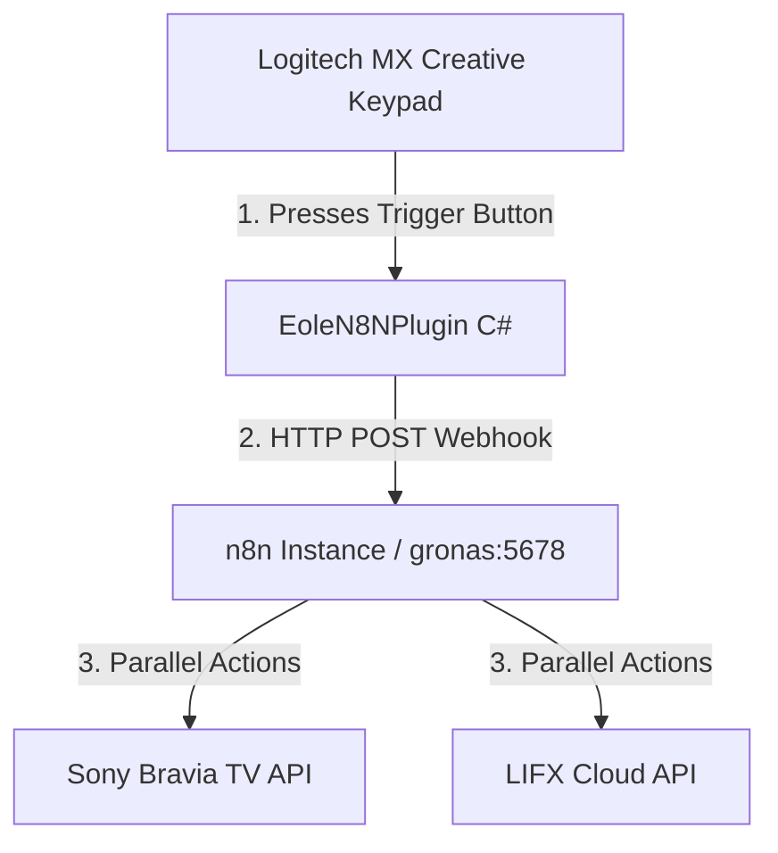

# Personal n8n Automation Workflows (n8n-perso)

This workspace organizes your personal n8n automation workflows and provides a dedicated standalone Logitech MX Creative Console plugin (**EoleN8NPlugin**) to trigger those workflows directly from your keypad.

## 🚀 System Architecture



---

## 🛠️ n8n Sync & Maintenance Toolkit

You can manage, backup, and push your n8n workflows using the Python toolkit in the [toolkit/](file:///home/eole/projects/n8n-perso/toolkit) folder:

* **Backup all workflows from n8n**:
  ```bash
  python3 toolkit/sync_n8n.py --backup-all
  ```
* **Push/Deploy local workflows to n8n**:
  ```bash
  python3 toolkit/sync_n8n.py --push-all
  ```

---

## 🔌 Eole n8n Trigger Plugin (Loupedeck/Logi)

The project contains a lightweight standalone C# plugin located in [EoleN8NPlugin/](file:///home/eole/projects/n8n-perso/EoleN8NPlugin) designed to trigger any n8n workflow.

### 1. How it works
The plugin dynamically loads your list of custom webhook triggers from a configuration file located in your Windows Documents folder:
👉 `C:\Users\YOUR_USERNAME\Documents\n8n_triggers.json`

If the file does not exist, the plugin automatically initializes it on first run with a default **Movie Mode** trigger.

### 2. Configure your Triggers
You can add, edit, or remove triggers simply by modifying the JSON configuration:
```json
[
  {
    "id": "movie_mode",
    "name": "Movie Mode",
    "url": "http://gronas:5678/webhook/movie-mode",
    "color": "#8200FF"
  },
  {
    "id": "netflix",
    "name": "Netflix",
    "url": "http://gronas:5678/webhook/movie-mode?app=netflix",
    "color": "#E50914"
  }
]
```

* **id**: Unique key identifier.
* **name**: Label displayed on your MX Creative Console key.
* **url**: n8n webhook URL to trigger.
* **color**: Hex color code used to draw a premium border and text for the console key.

*Note: The console will automatically update and reload button labels and border colors based on this file.*

### 3. Build and Deploy
* **Install .NET 8.0 SDK (if missing)**:
  ```bash
  make prepare
  ```
* **Build, Deploy, and Restart Logitech Service**:
  ```bash
  make
  ```
  *(This compiles the C# codebase on WSL, deploys it to the Logitech Windows directory, and restarts the Options+ service).*

---

## 🎬 Default Use Case: Movie Mode
1. **Trigger**: Pressed from the MX Keypad (invokes webhook POST to `/webhook/movie-mode`).
2. **Sony Bravia TV**: Turns on the living room TV via IP control (`/sony/system` endpoint).
3. **LIFX Lights**: Powers on and sets your smart lights to a 20% dim.
